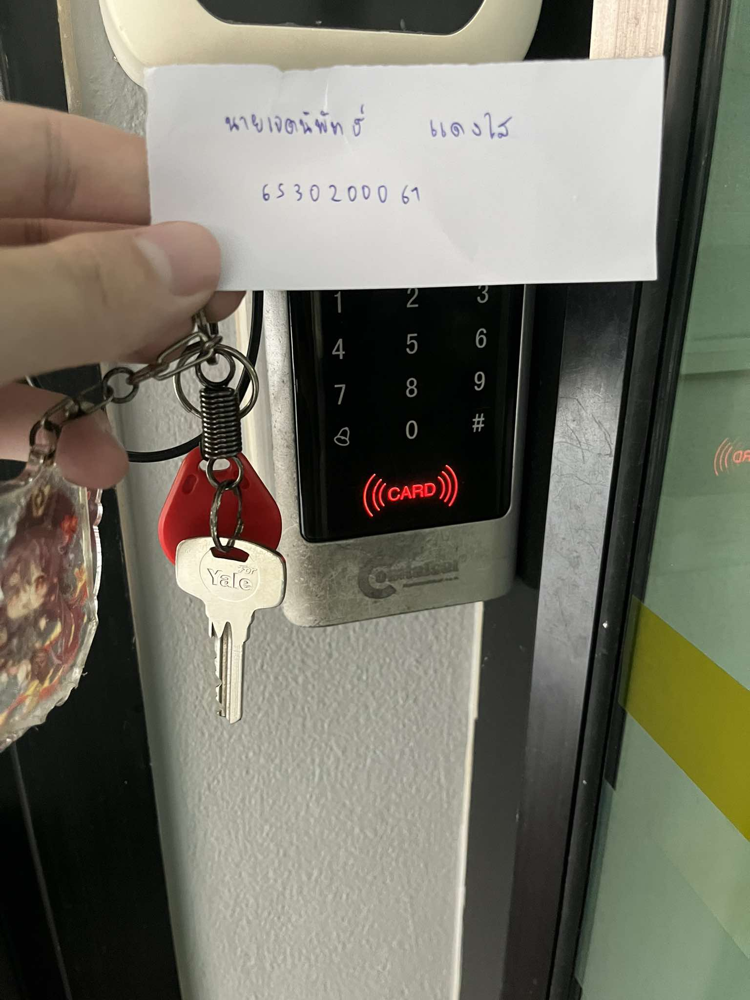

# Security Control
### การสแกนคีย์การ์ดเข้าหอพัก

- ***สถานที่:*** หอพัก
- ***Control Function:*** Preventative
- ***Type of Security Control:*** Physical Control
- ***ทำไมการสแกนคีย์การ์ดเข้าหอพักจึงเป็น Physical Control ประเภท Preventative:*** เพราะเป็นมาตรการที่เกี่ยวข้องกับการควบคุมทางกายภาพของพื้นที่ และเป็น Preventative Control เพราะทำหน้าที่ในการ ป้องกัน การเข้าถึงโดยไม่ได้รับอนุญาตตั้งแต่ต้น ซึ่งช่วยลดโอกาสในการเกิดเหตุการณ์ที่ไม่พึงประสงค์ เช่น การลักทรัพย์หรือการบุกรุก

